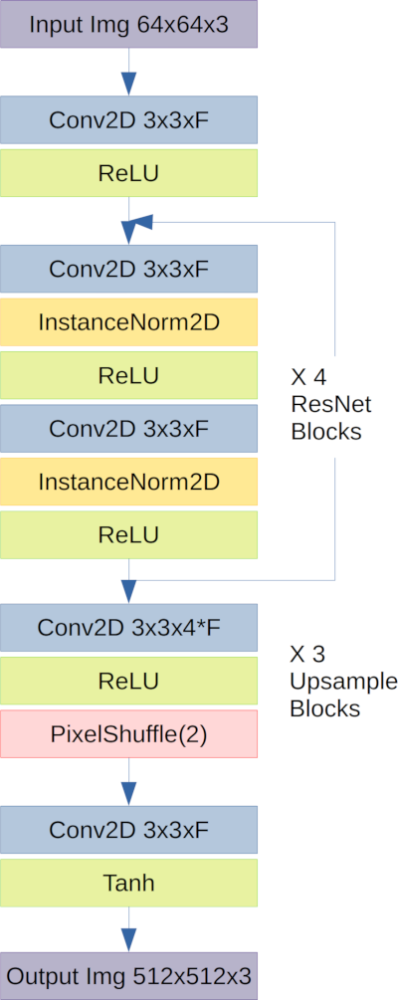

# Super Resolution Image Enhancement
###### UW Madison CS766 - Computer Vision, Spring 2020

|Prev: [Introduction](SR_Introduction.md) | Up: [Main](SR_Main.md) | Next: [Inferencing Results](SR_Results.md) |

# Building the Super Resolution Network
Building the Super Resolution Network consisted of 3 steps, typical of any deep neural network development. A large training data set was located and acquired. A network model and loss function was designed, coded, trained, and evaluated. The model was adjusted and retrained over several iterations to improve results.

## Training Dataset
The training, validation, and test data for our project consists of images from the [OpenImages V5 Dataset](https://storage.googleapis.com/openimages/web/index.html). The full data set consists of an astonishing 9 million images with a combination of human-verified and machine-generated labels. For our training, we decided to focus on training using a subset of these images. After reviewing the labels in the entire dataset, we chose four distinct labels on which to focus: ‘Building,’
‘Dog,’ ‘Flower,’ and ‘Food.’ By narrowing down the scope of image content, and choosing four distinct image subjects (domains) we enable intra- and cross-label inference testing. After deciding on the appropriate images to use, the acquisition of a data set was broken down into 3 phases: image retrieval, training image preparation, and comparison image preparation.
### Image Retrieval
Simply managing the process of acquiring the images was a formidable task. For example, the ```.csv``` file
containing the image identifiers, their corresponding label identifiers, and their web locations is a 3.2 GB
file, which itself had to be parsed and searched for images containing the labels of interest. A python
script ([Retriever.py](https://github.com/elbrandt/CS766_Project/blob/master/dataset/Retriever/Retriever.py)) was written to perform this task. Because we wanted to focus on large, high resolution images, we used the file size (contained as a field in the ```.csv file```) as a heuristic, and only downloaded images that a) had one of our labels, and b) had a file size greater than 5MB. The script was allowed to run for approximately 12 hours, downloading copyright-free and royalty-free images meeting these criteria from the web.

### Training Image Preparation
Once a sufficient number of candidate images having each label were downloaded, we prepared the images
using a second Python script ([Resizer.py](https://github.com/elbrandt/CS766_Project/blob/master/dataset/Retriever/Resizer.py)). Using [OpenCV](https://opencv.org/), this script opened each image and performed the following operations:
1. If the image had a resolution under 2048x2048, the image was discarded from the training set. We are
only interested in high resolution images.
2. The image was center-cropped to 2048x2048, to match the input dimensions of our training network.
This full-resolution crop was saved.
3. The image was then incrementally downsampled using bilinear interpolation by factors of 2, saving at
each resolution. Each image was saved at square resolutions of 2048, 1024, 512, 256, 128, and 64.
We note that at the lower resolutions (e.g. 64x64), the image quality was significantly higher if the scaling
was performed in ‘steps,’ visiting each intermediate power of two enroute to the final resolution. Image
quality was much worse if we rescaled directly from the high resolution to the low resolution. Therefore, we
settled on the former approach to build our training images.
After this phase, our training data set consisted of the images shown here:

| Domain   | # of Images |
|----------|:-----------:|
| Building | 24,530      |
| Food     | 17,855      |
| Dog      | 10,736      |
| Flower   | 24,100      |

100 random images from each of the four domains were pulled out and never used during training. These 400 images served as the 'test' images used to evaluate the capability of trained network.

### Comparison Image Preparation
The above steps produced ample training data. However, to compare our super-resolution method with
‘traditional’ upscaling methods, we also generated a comparison data set. To do this, a third Python
script ([Upsampler.py](https://github.com/elbrandt/CS766_Project/blob/master/dataset/Retriever/Upsampler.py)) was written. This script takes as input a ‘starting’ and ‘ending’ resolution. It then
traverses the local data set, and upscales all images that are saved at the ‘starting’ resolution using bilinear
interpolation to the ‘ending’ resolution. The output of this process gives us a point of comparison for our
method versus the most widely used traditional method for increasing image resolution.

## Network Structure
The network used for super-resolution was based on ResNet and upsampled using
a pixel shuffle operation which is fully learnable. 4 ResNet blocks were used
with instance normalization and relu activation. The output from the ResNet
block was summed with the input per typical ResNet use. 3 successive upscaling
operations were used, each with factor of 2 for total image upscaling factor
of 8.


<p align="center">
  
</p>

The network was trained using a combination of pixel loss and feature loss.
Pixel loss is defined as the mean squared error between the images. Feature loss
was based on the 4th layer of the pre-trained VGG19 network (relu_1_2), and
computed as the MSE between the features in the prediction and the features in
the target. While pixel-error minimizes image error, feature loss had been shown
to promote high-frequency reconstruction.

The full loss function is given by:


where x and y are the prediction and target images.

---

|Prev: [Introduction](SR_Introduction.md) | Up: [Main](SR_Main.md) | Next: [Inferencing Results](SR_Results.md) |

Asher Elmquist (```amelmquist@wisc.edu```), Eric Brandt (```elbrandt@wisc.edu```) 2020
