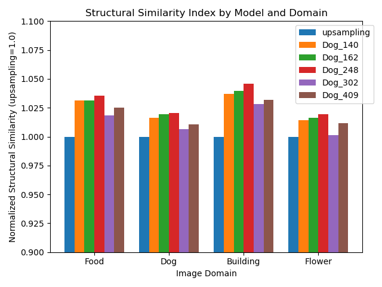
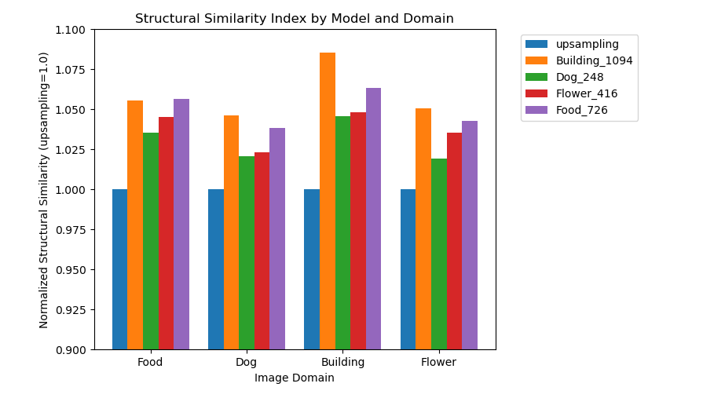

# Super Resolution Image Enhancement
###### UW Madison CS766 - Computer Vision, Spring 2020

|Prev: [Inferencing Results](SR_Results.md) | Up: [Main](SR_Main.md) | Next: [SR and Image Segmentation](SR_Segmentation.md) |

# Domain Specific Training and Inferencing
Having established that we can achieve good results with a Super Resolution network, we investigated two questions about the types of images used for Super Resolution. 
1. What are the effects of training the the CNN model purely on images having a specific label. For example, how would a CNN model trained purely on 'Building' images compare to a CNN model trained purely on 'Food' images.
2. Given a trained model, does its performance differ based on the types of images it is tested against? For example, does a CNN model trained on 'Building' images perform better on test 'Building' images than it does on test 'Flower' images? 

To answer these questions, we trained four separate CNN models. Each model was trained exclusively with 10,000 images containing a single primary label.  We evaluated the performance of each model by using the 'Normalized SSIM' described [here](SR_Results.md#objective-performance-measure---ssim).

During training, the model was evaluated periodically to determine the (rough) optimal amount of training time, watching for indications of overtraining. As an example, we can see that the when training the model against 'Dog' labeled images, we empirically observed the best results were achieved around 248 presentations of the 10,000 images (epochs). In this chart, we see the performance relative to linear interpolation ('upsampling') of the 'Dog' model on all test data sets, when the training was stopped after 140, 162, 248, 302, and 409 epochs. Each bar in the chart represents the mean of the Normalized SSIM of 100 training images of the specified label.

<p align="center">
  
</p>

After training and monitoring the progress of all four CNN models, we compared the four models by testing them on the four separate test data sets. The results are shown in the following chart:

<p align="center">
  
</p>

### Observational Analysis

These results suggest that certain types of images (Buildings) are generally better for training SR networks regardless of what the test data set will contain (the orange bar is higher across all domains). Conversely, it also seems apparent that certain domains of images respond better to SR inferencing than others (the 'Building' domain seems to respond to SR inferencing than the other image domains, regardless of how the model was trained). 

One could theorize that this might be due to architectural style photographs having more sharp edges which become highly pixelated at reduced resolutions, and SR inferencing can restore these edges with high accuracy. Such edge recovery is not nearly as good with simple linear interpolation due to the blurring effect it induces. On the other hand, domains such as Food and Flowers characteristically have considerably more high frequency information in their high resolution images. This information is lost during downsampling, and it is much harder for a SR CNN to learn what might be missing during inferencing, making its inference less distinguished from simple linear interpolation. 

### Statistical Analysis

We have shown in the [Objective Results](SR_Results.md#objective-performance-measure---ssim) section that the SSIM gain of SR images over baseline 'linear interpolation upscaling' images is statistically significant (p < 0.001).  

The question now becomes: Is there any statistical significance to the domain-specific training, and domain-specific inferencing using a particular trained model? To answer this question, we again draw upon the Student-T test. Each row in the table below is based on a particular CNN model, trained only on a particular class of images. Each colum represents a class of images that the model was tested on. The p-value in each entry is the statistical significance of the trained model inferencing a given image domain *in comparison to* using that model to inference images of the domain on which it is trained.  

For example, in the first row, second column, we can conclude that the performance of the Building-trained Model on Buildings versus its performance on Dogs *is* statistically significant (p < 0.001).  However, the Dog-trained Model's performance on Dogs versus its performance on Flowers (row 2, column 3, p=0.512) is really no better than random chance.

<style type="text/css">
.tg  {border-collapse:collapse;border-spacing:0;}
.tg td{border-color:black;border-style:solid;border-width:1px;font-family:Arial, sans-serif;font-size:14px;
  overflow:hidden;padding:10px 5px;word-break:normal;}
.tg th{border-color:black;border-style:solid;border-width:1px;font-family:Arial, sans-serif;font-size:14px;
  font-weight:normal;overflow:hidden;padding:10px 5px;word-break:normal;}
.tg .tg-fn5d{border-color:inherit;color:rgb(0, 0, 0);text-align:left;vertical-align:middle}
.tg .tg-baqh{text-align:center;vertical-align:top}
.tg .tg-omgv{border-color:inherit;color:rgb(0, 0, 0);text-align:center;vertical-align:middle}
.tg .tg-lu0m{color:rgb(0, 0, 0);text-align:left;vertical-align:top}
.tg .tg-0lax{text-align:left;vertical-align:top}
.tg .tg-exjq{color:rgb(0, 0, 0);text-align:left;vertical-align:middle}
</style>
<table class="tg">
  <tr>
    <th class="tg-0lax"></th>
    <th class="tg-baqh" colspan="5">Image Domain</th>
  </tr>
  <tr>
    <td class="tg-0lax"></td>
    <td class="tg-lu0m"><br></td>
    <td class="tg-exjq">Building</td>
    <td class="tg-exjq">Dog</td>
    <td class="tg-exjq">Flower</td>
    <td class="tg-exjq">Food</td>
  </tr>
  <tr>
    <td class="tg-baqh" rowspan="4"><br>Training<br>Model</td>
    <td class="tg-fn5d">Building</td>
    <td class="tg-omgv">N/A</td>
    <td class="tg-omgv">&lt; 0.001</td>
    <td class="tg-omgv">0.008</td>
    <td class="tg-omgv">&lt; 0.001</td>
  </tr>
  <tr>
    <td class="tg-fn5d">Dog</td>
    <td class="tg-omgv">&lt; 0.001</td>
    <td class="tg-omgv">N/A</td>
    <td class="tg-omgv">0.512</td>
    <td class="tg-omgv">0.005</td>
  </tr>
  <tr>
    <td class="tg-fn5d">Flower</td>
    <td class="tg-omgv">0.400</td>
    <td class="tg-omgv">0.051</td>
    <td class="tg-omgv">N/A</td>
    <td class="tg-omgv">0.609</td>
  </tr>
  <tr>
    <td class="tg-fn5d">Food</td>
    <td class="tg-omgv">0.232</td>
    <td class="tg-omgv">&lt; 0.001</td>
    <td class="tg-omgv">0.572</td>
    <td class="tg-omgv">N/A</td>
  </tr>
</table>

###### Table: p-values of Domain-specific models inferencing on their own image types versus other image types

In many cases, we can clearly say that a domain-specific CNN is better suited for inferencing certain types of images, but we cannot make a generalized statement that this is always the case.  However, a takeaway recommendation is that *it can make a difference*, and if one planse to use SR techniques for a very specific application, it does make sense to take the subject matter of the data into account during the training phase, simply using a pre-trained open-source SR model may not give the best performance in highly domain-spefific applications.

---

|Prev: [Inferencing Results](SR_Results.md) | Up: [Main](SR_Main.md) | Next: [SR and Image Segmentation](SR_Segmentation.md) |

Asher Elmquist (```amelmquist@wisc.edu```), Eric Brandt (```elbrandt@wisc.edu```) 2020
