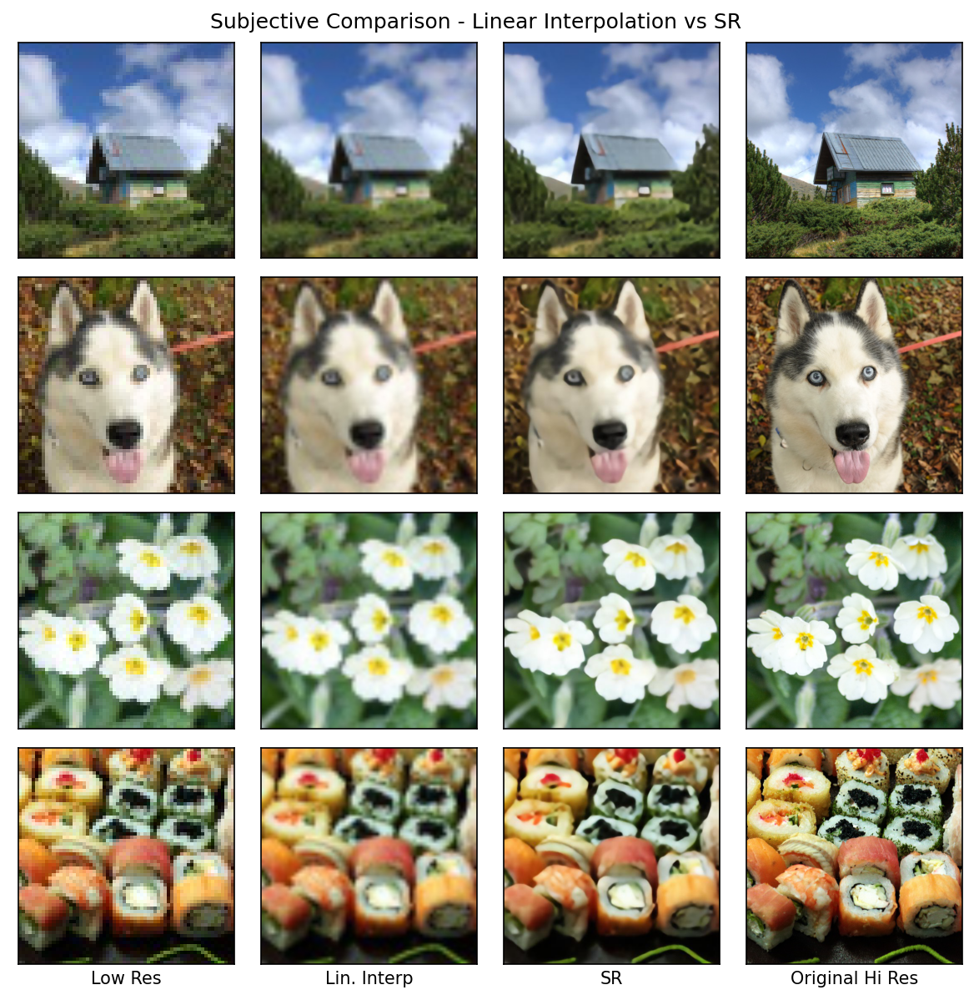

# Super Resolution Image Enhancement
###### UW Madison CS766 - Computer Vision, Spring 2020

|Prev: [Building the Super Resolution Network ](SR_Building.md) | Up: [Main](SR_Main.md) | Next: [Domain Specific Training and Inferencing](SR_DomainSpecific.md) |

# Inferencing Results
After preparing the training data and training the CNN, the first natural question to ask is, 'How well does it work?' To answer this question, we used both a subjective (human perception, vision, and opinion) approach, and an objective (mathematical, algorithmic) approach.

## Subjective Super-Resolution Results
      
For subjective SR results of our network, we let the images speak for themselves. Below are four rows representative test images. The columns from left to right are a) low resolution image, b) linear interpolation upsampling of low resolution image to high resolution, c) Super Resolution inferencing of low resolution image to high resolution, and d) original high resolution image

<p align="center">
  
</p>

<p align="center">
  
</p>

## Objective Performance Measure - SSIM

While subjective evaluation of performance is a good approach if the final images are only to be viewed by humans. But, a subjective evaluation lacks rigor, and has little relevance to the suitability for other CV downstream processes. For these reasons, we also sought to perform an objective evaluation to answer just how much better SR enhancement is compared to bilinear interpolation upsampling.

Many algorithmic metrics to compute the similarity of two images have been used in CV literature. Mean Squared Error is common, with a slight improvement being Normalized Root Mean Squared Error. Peak Signal-to-Noise Ratio has also been used. Each of these methods is easy to compute, but have relatively common cases where their numerical results do not match perceived (subjective) quality.  A more recent metric that has gained considerable popularity is Structural Similarity Index, proposed and described in detail by Zhang in [[19]](SD_Conclusion.md#references). The goal of this metric is to produce a metric that is tuned solely to the *structural* difference of an image. To calculate this, the scene luminance and scene intensity differences between the images are equalized by subtracting the mean of those values and then normalizing by the variance of those values from each image. Having equalized these differences, 3 separate metics are then calculated for remaining luminance, remaining contrast, and remaining structure. These are combined and normalized again to give a 'SSIM' metric such that a perfect match yields an index of 1.0 and dissimilar images score below 1.0. 

Using SSIM as our metric for objective comparison, we evaluated our 400 test images across the four image domains. First, we calculated the SSIM of our linear interpolation upsampled images with respect to the original high-resolution image. This served as our baseline. We then calculated the SSIM of our SR inferenced image.  To make comparison easier, we developed a 'Normalized SSIM' metric that first normalizes the SSIM performance of the upsampled images to 1.0, and then scaled the SR image's SSIM metric relative to that. This allows our metric values to be interpreted, roughly speaking, as a 'percentage improvement' over the baseline method. That is, if the SR method scores a 1.1 in our 'Normalized SSIM', then it is performing 10% better than linear interpolation upsampling under the SSIM metric.

TODO: SSIM Bar Chart of Upsampled vs SR across 4 domains

---
|Prev: [Building the Super Resolution Network ](SR_Building.md) | Up: [Main](SR_Main.md) | Next: [Domain Specific Training and Inferencing](SR_DomainSpecific.md) |

Asher Elmquist (```amelmquist@wisc.edu```), Eric Brandt (```elbrandt@wisc.edu```) 2020