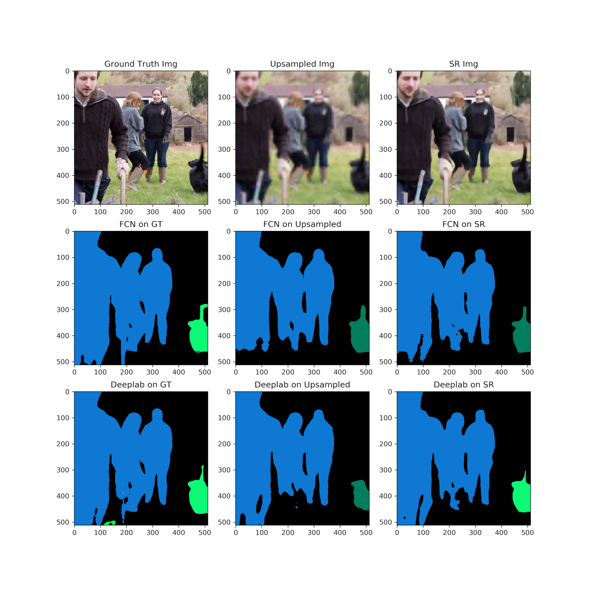
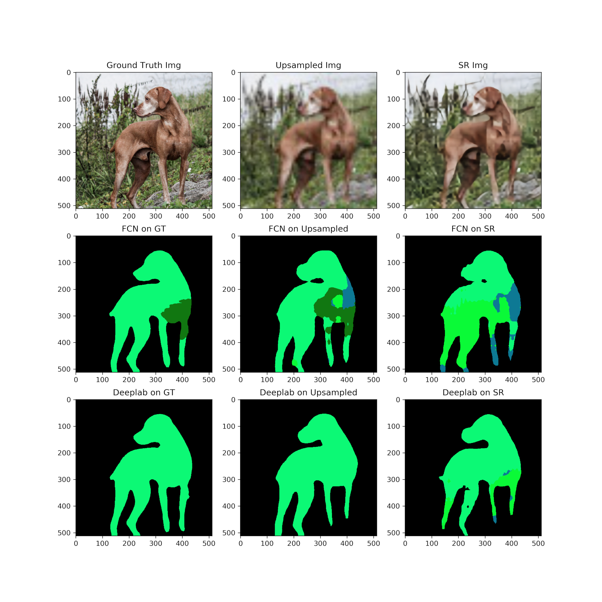

### Image Segmentation of Super-Resolution Images

Sample segmented images from pre-trained segmentation experiment.

Error rate when segmenting upsampled images vs super-resolved images.

| Metric | Upsampled | SR  |
| :-------------: | :-----:|:-----:|
| FCN      | 20.0% | 25.8% |
| DeepLabV3 |   13.5% |  26.4% |

