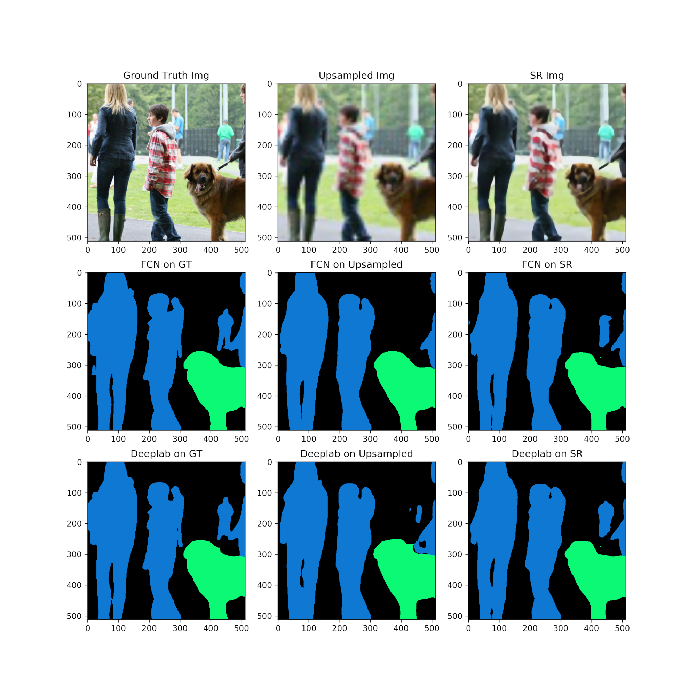

# Super Resolution Image Enhancement
###### UW Madison CS766 - Computer Vision, Spring 2020

|Prev: [Domain Specific Training and Inferencing](SR_DomainSpecific.md) | Up: [Main](SR_Main.md) | Next: [Conclusion](SR_Conclusion.md) |

# Image Segmentation of Super-Resolution Images

An interesting application of super-resolution would be in sub-pixel image segmentation. If we could effectively super-resolve to improve the image, we would be able to provide higher precision boundary of objects and classes. While the super-resolution network was able to generate image with higher SSIM to the ground truth, that does not guarantee an improvement for a given application. To demonstrate this, we tested the effect of super resolving on image segmentation. To this end, we used two pre-trained networks that were trained on the COCO dataset then applied on 77 test images from the Dog domain.

The segmentation results were compared using segmentation on the high resolution images taken as ground truth. Across the 77 test images, it was found that segmentation performance decreased significantly. The super-resolution network with the highest SSIM was used as the upsampling network in this experiment. Here are the error rates when using direct upsampling vs the SR network (lower is better).

| Metric    | Upsampled Error Rate | SR Error Rate     |
| :------:  | :-----:   | :-----: |
| FCN       | 20.0%     | 25.8%   |
| DeepLabV3 | 13.5%     | 26.4%   |

There also seems not to be a strong correlation that would suggest an improvement in SSIM would lead to improvement in segmentation. The results of segementation vs SSIM are shown here:

<center>

</center>

Here are some interesting examples showing the results of segmentation. The primary error mode is a change of class to person or other non-background class. In the segmentation map, black is background, blue is person, light green is dog.

<center>





</center>
---

|Prev: [Domain Specific Training and Inferencing](SR_DomainSpecific.md) | Up: [Main](SR_Main.md) | Next: [Conclusion](SR_Conclusion.md) |
Asher Elmquist (```amelmquist@wisc.edu```), Eric Brandt (```elbrandt@wisc.edu```) 2020
